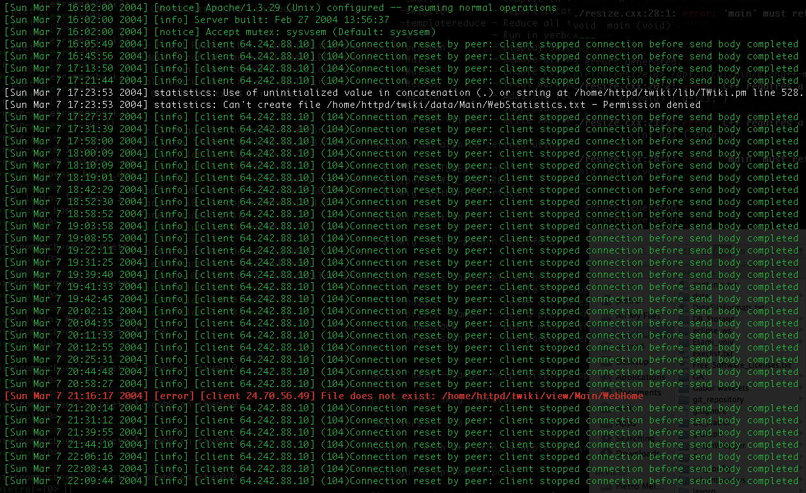
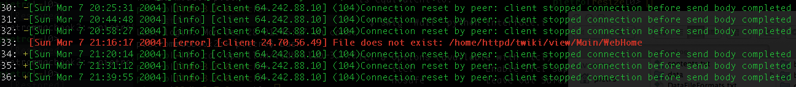

# logviewer

#### - Log files viewer & text highlighter.

Features:

- Text mode log viewer, runs everywhere after recompilation.

- Dynamic log level threshold: in the proximity of logs with high level,
  automatically lower the level threshold to provide context for critical cases.

- Log level based highlighting (on Linux, OS-X, Windows).
	- Levels can be numeric (1-7) or strings.
	- Custom level tags can be specified on a file.

- Log file format agnostic.
	- Log level tag position automatically found in the logs.

- Filtering capability.

- Text highlighter: specifying custom keywords with a priority level, highlights text files,
  shows context, and hides non relevant parts.

- Free software, GPL 3 license.

For better performance, consider logging to a ramdisk.

Requirements:
- C++11
- Default build system: CMake

##### - Example: Apache log file

Original log file:

Command:  `logviewer --input "example.log" --minLevel 0`

Show logs with minimal level 4, and, for logs with level greater or equal to 5, show a 3 logs context (- pre and + post)
with logs with minimal level 2:

Command:  `logviewer --input "example.log" --minLevel 4 --contextWidth 3 --minLevelForContext 5 --minContextLevel 2 -ln`

