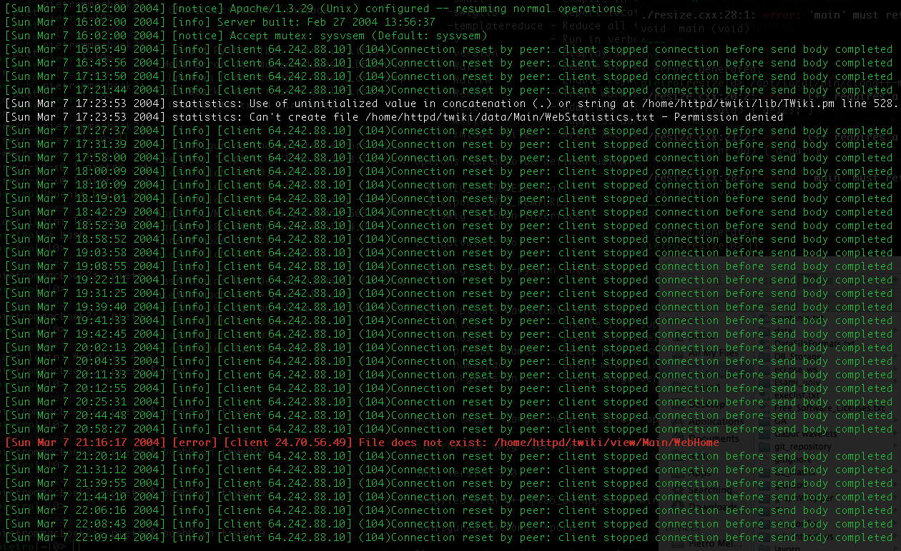
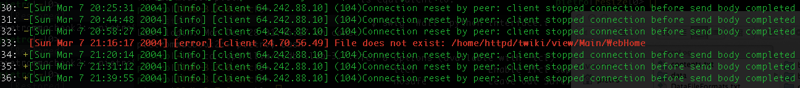

# logviewer

#### - Log files viewer & text highlighter.

Features:

- Text mode log viewer, runs everywhere after recompilation.

- Dynamic log level threshold: in the proximity of logs with high level,
  automatically lower the level threshold to provide context for critical cases.

- Log level based highlighting (on Linux, OS-X, Windows).
	- Levels can be numeric (1-7) or strings.
	- Custom level tags can be specified on a file.

- Log file format agnostic.
	- Log level tag position automatically found in the logs.

- Filtering capability.

- Text highlighter: specifying custom keywords with a priority level, highlights text files,
  shows context, and hides non relevant parts.

- Free software, GPL 3 license.


For better performance, consider logging to a ramdisk.


Requirements:
- C++11
- Default build system: CMake


##### - Example: Apache log file

Original log file:

Command:  `logviewer --input "./test/example.log" --minLevel 0`



Show logs with minimal level 4, and, for logs with level greater or equal to 5, show a 3 logs context (- pre and + post)
with logs with minimal level 2:

Command:  `logviewer --input "./test/example.log" --minLevel 4 --contextWidth 3 --minLevelForContext 5 --minContextLevel 2 -ln`



##### - Example: underline a Wikipedia page

Original text:

```
Code refactoring

From Wikipedia, the free encyclopedia

"Refactor" redirects here. For the use of 'refactor' on Wikipedia, see Wikipedia:Refactoring talk pages.
Not to be confused with Code factoring.

Code refactoring is the process of restructuring existing computer code –
changing the factoring – without changing its external behavior. Refactoring
improves nonfunctional attributes of the software. Advantages include improved
code readability and reduced complexity; these can improve source code
maintainability and create a more expressive internal architecture or object
model to improve extensibility. Typically, refactoring applies a series of
standardised basic micro-refactorings, each of which is (usually) a tiny change
in a computer program's source code that either preserves the behaviour of the
software, or at least does not modify its conformance to functional
requirements. Many development environments provide automated support for
performing the mechanical aspects of these basic refactorings. If done
extremely well, code refactoring may also resolve hidden, dormant, or
undiscovered computer bugs or vulnerabilities in the system by simplifying the
underlying logic and eliminating unnecessary levels of complexity. If done
poorly it may fail the requirement that external functionality not be changed,
and/or introduce new bugs.

	By continuously improving the design of code, we make it easier and easier to
	work with. This is in sharp contrast to what
	typically happens: little refactoring and a great deal of attention paid to
	expediently adding new features. If you get into the hygienic habit of
	refactoring continuously, you'll find that it is easier to extend and maintain
	code.
		— Joshua Kerievsky, Refactoring to Patterns[1] Contents [hide]
```


In the file `./test/testText_logLevels.txt` specify the keywords to look for with their priority:

```
refactoring 6
Wikipedia   2
Refactor    6
Code        5
cycle       4
technique   3
OOP         2
field       1
```

Command:  `logviewer -i ./test/testText.txt -ll ./test/testText_logLevels.txt -m 3 --text -d .`


